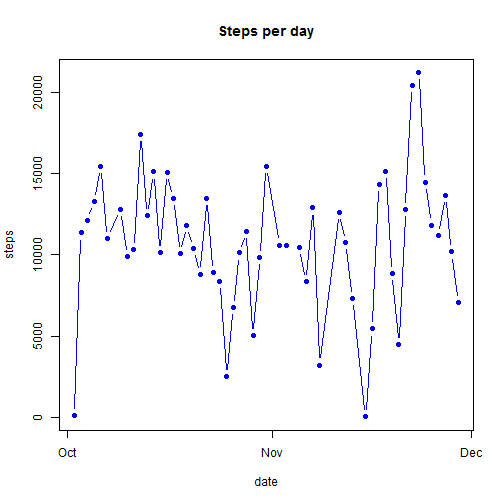
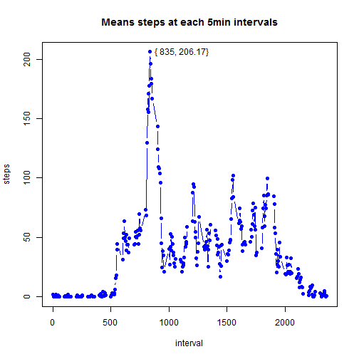
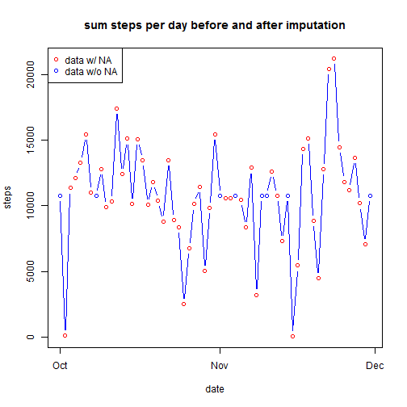
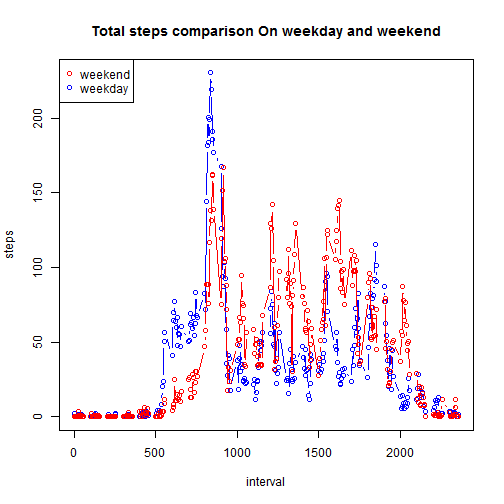

This is an R Mardown document in response to Peer Assignment 1 of Reproudcible Research. This document will report exploratory results using dataset [Activity monitoring data [52K]](https://d396qusza40orc.cloudfront.net/repdata%2Fdata%2Factivity.zip), addressing the following data-preparation and exploratory questions:

1. Loading and preprocessing the data
2. What is mean total number of steps taken per day?
3. What is the average daily activity pattern?
4. Imputing missing values
5. Are there differences in activity patterns between weekdays and weekends?

The responses are as follows:
## 1. Loading and preprocessing the data
The codes below assuming the dataset has been downloaded and unzipped to the current working directory. The date variable is read in as character, then transformed to date formate.


```r
data<-read.table("./repdata-data-activity/activity.csv",sep=","
                 ,header=T, na.string="NA",
                 colClasses=c("numeric", "character","numeric"))
data$date<-as.POSIXct(data$date, format="%Y-%m-%d")
```

## 2. What is mean total number of steps taken per day?
The total steps for each day is calculated using function *Aggregate*, and median, mode information can be read off of *summary* table.

```r
stepAgg<-aggregate(data=data, steps~date, FUN=sum)
plot(stepAgg, type="b", col="blue",main="Steps per day", pch=19)
```

 

```r
summary(data$steps)
```

```
##    Min. 1st Qu.  Median    Mean 3rd Qu.    Max.    NA's 
##     0.0     0.0     0.0    37.4    12.0   806.0    2304
```

## 3. What is the average daily activity pattern?
The plot below shows average steps taken at each interval over all the recorded days, with maximum values printed on the plot.

```r
stepAgg_interval<-aggregate(data=data, steps~interval, FUN=mean)
plot(stepAgg_interval,type="b", col="blue", main="Means steps at each 5min intervals", pch=19)
maxInter<- stepAgg_interval[which.max(stepAgg_interval$steps),"interval"]
maxSteps<- stepAgg_interval[which.max(stepAgg_interval$steps),"steps"]
maxText<-sprintf("{ %i, %3.2f}", maxInter, maxSteps)
text(x=maxInter,y= maxSteps, pos=4, maxText)
```

 

## 4. Imputing missing values
All the NAs occur in the steps variable, at about 13.1% occurance.

```r
mean(is.na(data[,1]))
```

```
## [1] 0.1311
```
NA inputs in the original dataset is imputed with the mean value of steps for that specific 5min interval, using function *imputeMean*.


```r
imputeMean<-function(x=data,y=stepAgg_interval){#x is data, y is aggregate data of steps by intervals
    missing_rows=which(is.na(x[,1]))
    for(z in missing_rows){
        intv<-x$interval[z]
        x$steps[z]<-y$steps[y$interval==intv]
    }
    
    return(x)
}
data1<-imputeMean(x=data,y=stepAgg_interval)
stepAgg1<-aggregate(data=data1, steps~date, FUN=sum)
plot(stepAgg1, type="b", col="blue", main="sum steps per day before and after imputation")
points(stepAgg,col=2)
legend("topleft",legend=c("data w/ NA","data w/o NA"),col=c(2,4),pch=1)
```

 
Data summary after imputation.

```r
summary(data1$steps)
```

```
##    Min. 1st Qu.  Median    Mean 3rd Qu.    Max. 
##     0.0     0.0     0.0    37.4    27.0   806.0
```
Data summary before imputation. 3rd Quantile value increased.

```r
summary(data$steps)
```

```
##    Min. 1st Qu.  Median    Mean 3rd Qu.    Max.    NA's 
##     0.0     0.0     0.0    37.4    12.0   806.0    2304
```
## 5. Are there differences in activity patterns between weekdays and weekends?


```r
data1$day<-weekdays(data1$date)
steps.week<-aggregate(data=data1, steps~day, FUN=sum)
data1$isWeekday<-ifelse(data1$day=="Monday"|
                        data1$day=="Tuesday"|
                        data1$day=="Wednesday"|
                        data1$day=="Thursday"|
                        data1$day=="Friday",
                        "weekday","weekend")

step.weekday<-aggregate(data=data1[data1$isWeekday=="weekday",], steps~interval, FUN=mean)
plot(step.weekday,type="b", col="blue",main="Total steps comparison On weekday and weekend")
step.weekend<-aggregate(data=data1[data1$isWeekday=="weekend",], steps~interval, FUN=mean)
lines(step.weekend,col=2, type="b")
legend("topleft",legend=c("weekend","weekday"),col=c(2,4),pch=1)
```

 

Perform Welch t-test on 2 means. The difference is not significant with p-value at 0.939, though on average weekday steps (609.9) are slightly fewer than weekend steps (606.6) 

```r
t.test(step.weekend,step.weekday)
```

```
## 
## 	Welch Two Sample t-test
## 
## data:  step.weekend and step.weekday
## t = 0.0762, df = 1150, p-value = 0.9393
## alternative hypothesis: true difference in means is not equal to 0
## 95 percent confidence interval:
##  -83.57  90.33
## sample estimates:
## mean of x mean of y 
##     609.9     606.6
```
